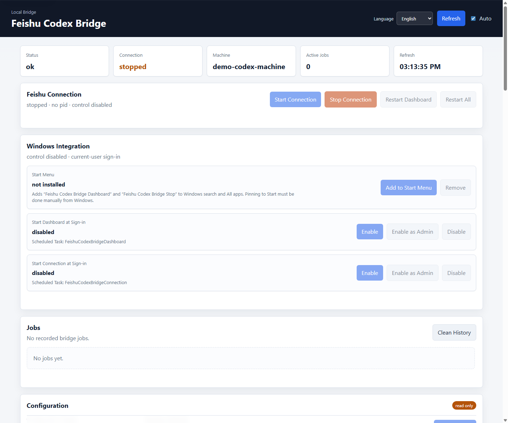

# Feishu Codex Bridge

English | [简体中文](README.zh-CN.md)

Feishu Codex Bridge is a local Python bridge that turns Feishu/Lark bot messages into `codex exec` jobs. It is designed for small, auditable personal or team deployments where Feishu is the chat entrypoint and Codex CLI does the local work.

The production runtime is the Python implementation in [feishu_codex_bridge.py](feishu_codex_bridge.py). Experimental Kotlin/Compose rewrite files are intentionally not part of the default release path until they reach parity with the Python bridge.

## Screenshots



More screenshots and regeneration notes live in [docs/SCREENSHOTS.md](docs/SCREENSHOTS.md).

## What It Does

- Receives Feishu/Lark bot messages through the official `lark-cli` long-connection event stream.
- Runs approved requests with the local `codex exec` command.
- Supports private chats, group chats, threaded follow-ups, queued guidance, and resumable Codex sessions.
- Uses explicit access policies for users, user groups, chats, workspaces, executable tasks, models, and skills.
- Downloads supported incoming images/files/audio/video through `lark-cli`; images can be passed to Codex when the local CLI supports `--image`.
- Serves a loopback-only dashboard for jobs, logs, capabilities, access policy editing, process control, and Windows integration.
- Stores runtime state as local JSON/JSONL files so behavior stays inspectable.

## Architecture

The default architecture is Python-first:

```text
feishu_codex_bridge.py
  CLI entrypoint, bridge coordinator, dashboard HTTP server, Lark transport,
  job scheduling, Codex process execution, sessions, and replies.

feishu_bridge/
  config_store.py     config validation, typed coercion, dashboard write allowlist
  runtime_paths.py    derived log/state/job/artifact paths

dashboard/
  index.html          local operations UI
  dashboard.css
  dashboard.js

tests/
  unittest coverage for config and bridge behavior
```

See [docs/PYTHON_ARCHITECTURE.md](docs/PYTHON_ARCHITECTURE.md) for the incremental refactor direction. The repository keeps the flat `feishu_codex_bridge.py` entrypoint so the current Windows launchers remain simple and compatible.

## Requirements

- Windows PowerShell.
- Python 3.12 or newer.
- `lark-cli` configured for a Feishu/Lark app.
- `codex` CLI available on `PATH`.
- Optional: GitHub CLI (`gh`) for repository maintenance.

## Quick Start

Copy the example config:

```powershell
Copy-Item .\bridge.config.example.json .\bridge.config.json
```

Edit at least these local values:

- `machine_id`
- `log_dir`
- `state_dir`
- `workspaces`
- `private.allowed_sender_open_ids`
- `private.allowed_chat_ids`
- `public.allowed_sender_open_ids`
- `public.allowed_chat_ids`
- `access.identities`
- `access.user_groups`
- `access.groups`
- `preset_tasks`

`bridge.config.json` is ignored by Git because it normally contains local paths, chat IDs, open IDs, and deployment decisions.

Validate without connecting to Feishu:

```powershell
powershell -ExecutionPolicy Bypass -File .\Start-FeishuCodexBridge.ps1 -DryRun
```

Start the bridge:

```powershell
powershell -ExecutionPolicy Bypass -File .\Start-FeishuCodexBridge.ps1
```

Stop the bridge, dashboard, and bridge-started Codex jobs:

```powershell
powershell -ExecutionPolicy Bypass -File .\Stop-FeishuCodexBridge.ps1
```

## Dashboard

Start only the local dashboard:

```powershell
powershell -ExecutionPolicy Bypass -File .\Open-FeishuCodexBridgeDashboard.ps1
```

Default URL:

```text
http://127.0.0.1:8765/
```

The dashboard supports English and Simplified Chinese. It can show bridge status, recent jobs, logs, discovered Codex capabilities, editable access policies, and user-level Windows shortcuts/startup tasks. Process control and config writes are loopback-only and can be disabled with:

```json
{
  "dashboard": {
    "allow_config_write": false,
    "allow_process_control": false,
    "allow_shell_integration": false
  }
}
```

Keep the dashboard bound to `127.0.0.1` unless an external authentication layer is added.

## Feishu Commands

Identity and onboarding:

```text
/id
```

Built-ins:

```text
/cmd help
/cmd status
/cmd status <job_id>
/cmd history
/cmd capabilities
/cmd peers
/cmd sessions
/cmd new-session
```

Executable tasks:

```text
/cmd <preset_task> [input]
/task <preset_task> [input]
/task <preset_task>:<subtask_id> [input]
```

Free-form Codex jobs for users or chats with `allow_codex=true`:

```text
/ask [@node] [workspace=name] <prompt>
/ask --new [workspace=name] <prompt>
/ask mode=fast <prompt>
/ask model=gpt-5.4 reasoning=xhigh <prompt>
/ask skills=feishu,lark-doc <prompt>
```

Private chats can treat all allowlisted text as tasks when `private.treat_all_text_as_codex=true`. Group chats should normally require a bot mention or explicit command unless the group is tightly controlled.

## Access Model

Access is resolved from:

- `access.default_policy`
- matching `access.identities`
- matching `access.user_groups`
- the current `access.groups` chat policy

Chat policy is authoritative for that chat. If a chat group exists and the sender is not included by it, the sender falls back to the default policy instead of inheriting broad user grants.

Use constrained executable tasks for routine workflows:

```json
{
  "preset_tasks": {
    "mobile-review": {
      "enabled": true,
      "aliases": ["mobile-review", "移动端评审", "评审更新"],
      "workspace": "default",
      "required_skills": ["feishu", "lark-doc", "lark-base"],
      "prompt_template": "Handle only this approved workflow. Reject unrelated requests.\n\nUser input:\n{input}\n"
    }
  }
}
```

Use `allow_codex=true` only for trusted operators. Use `unrestricted=true` only for administrators who are allowed to bypass task/model/skill limits.

## Event Delivery

The bridge is intended to use Feishu/Lark long-connection events:

```powershell
lark-cli event +subscribe --as bot --filter '^(<event_types_regex>)$' --compact --quiet
```

Private polling is a fallback only. Keep `private.polling_fallback_enabled=false` when `im.message.receive_v1` is working.

See [docs/OPEN_PLATFORM_EVENTS.md](docs/OPEN_PLATFORM_EVENTS.md) for the sanitized app-side checklist.

## Security And Privacy

- Do not commit `bridge.config.json`, token files, logs, job state, attachments, or local analysis dumps.
- Keep explicit sender/chat/workspace allowlists.
- Keep dashboard and health endpoints on loopback.
- Use bot identity for normal bridge replies.
- Use user identity only for tasks that clearly need user-owned Feishu resources and already have valid user-token scopes.
- Do not add Open Platform permissions, request new scopes, publish app versions, or change event subscriptions from this bridge unless that is the explicit administrative task.
- Review generated screenshots before committing them; they should use placeholder IDs and sample state only.

## Repository Maintenance

Install and authenticate GitHub CLI:

```powershell
powershell -ExecutionPolicy Bypass -File .\Initialize-GitHubCli.ps1 -Login -SetupGit
```

Create a local ignored shell-token template:

```powershell
powershell -ExecutionPolicy Bypass -File .\Initialize-GitHubCli.ps1 -CreateLocalEnv
```

See [docs/GITHUB_AUTH.md](docs/GITHUB_AUTH.md) for browser login, token prompt, `GH_TOKEN`, and remote creation workflows.

## Validation

Run the same checks locally before committing:

```powershell
python -m py_compile .\feishu_codex_bridge.py
python -m unittest discover -s tests
Get-Content -Raw .\bridge.config.example.json | ConvertFrom-Json | Out-Null
foreach ($script in Get-ChildItem -Filter *.ps1) {
  $null = [scriptblock]::Create((Get-Content -Raw $script.FullName))
}
```

## License

MIT. See [LICENSE](LICENSE).
